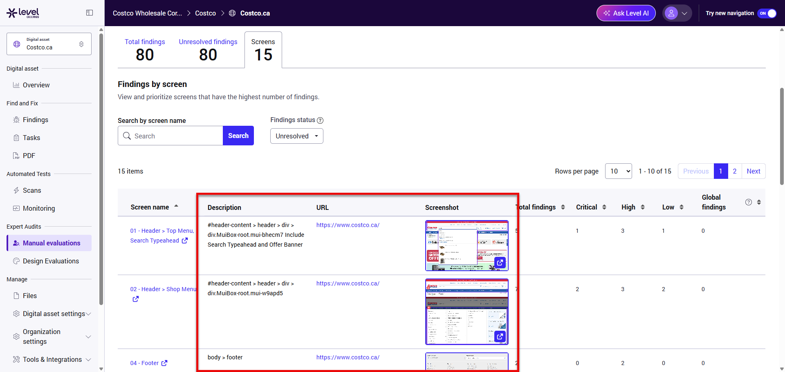

# LAPScript

LAPScript is a Tampermonkey userscript that enhances the Level Access Platform manual evaluation experience by improving findings and screens tables, adding quick actions, and improving image handling.

## Script File

- `https://raw.githubusercontent.com/ashleycallahan/LAPScript/refs/heads/main/LAPScript.js`

## What It Adds

- Table enhancements for findings and screens views.
- Inline screenshot/attachment previews in report tables.

- Quick links for opening items in new tabs.
- Edit-in-dialog workflow for findings.

- Lightbox viewer for finding images.

- Copy table content in rich HTML format for spreadsheet workflows.
- Extra controls such as Refresh, Copy Table, Highlight Rows, and Expand/Collapse Table.

- Search manual evaluations by Finding or Task ID.

## Requirements

- A userscript manager such as Tampermonkey.
- Access to a supported Level Access platform domain:
  - `*.essentia11y.com/*`
  - `*.levelaccess.io/*`
  - `*.essentialaccessibility.com/*`
- jQuery is loaded via the userscript `@require` directive.

## Installation

1. Open Tampermonkey and go to Dashboard.

2. Open the Utilities tab.
3. Locate "Import from URL"

4. Paste in `https://raw.githubusercontent.com/ashleycallahan/LAPScript/refs/heads/main/LAPScript.js`.
5. Save and enable the script.
6. Open a supported Level Access platform page.

## Versioning

- Current script header version: `1.1.7`

## Authors

- Original author: Ashley Callahan
