# LAPScript

LAPScript is a Tampermonkey userscript that enhances the Level Access Platform manual evaluation experience by improving findings and screens tables, adding quick actions, and improving image handling.

## Script File

- `https://raw.githubusercontent.com/ashleycallahan/LAPScript/refs/heads/main/LAPScript.js`

## Versioning

- Current script header version: `1.1.14`

If you are not seeing any of the features listed below, it is recommended that you [update](#installation).

## WARNING!

LAPScript is a custom JavaScript file that is intended to improve and enhance the delivered Level Access Platform UI. This script is NOT supported by IT or Product. By installing it you acknowledge that unintended interactions may occur between the script and Platform and that you will [turn this script off](#disabling-the-script) before reporting any issues to IT or Product. Bugs or feature requests that are related to the script can be logged at this GitHub location.

## What It Adds

- Screenshots, descriptions, and clickable URLs in report tables.
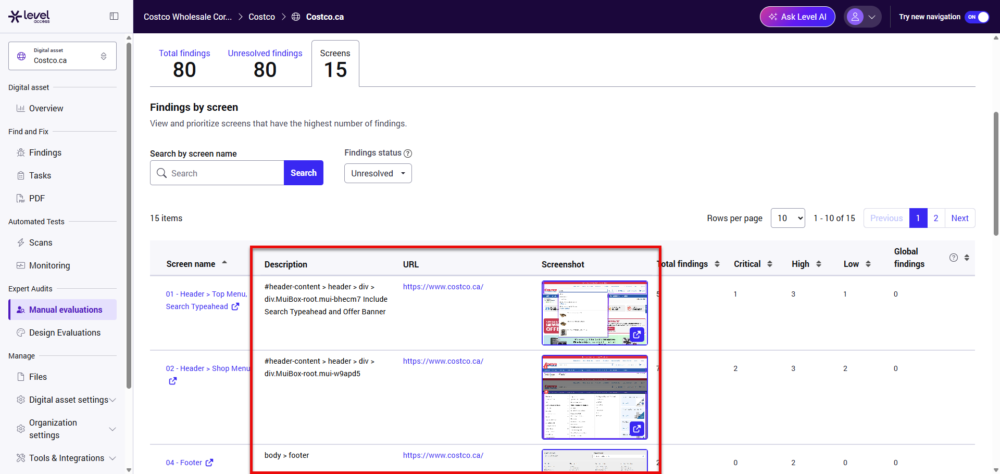
- Quick links for opening findings and screens in new tabs.
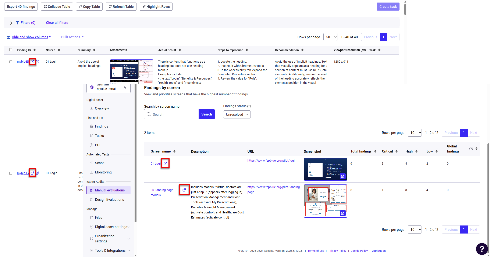
- Edit-in-dialog workflow for findings.

- Lightbox viewer for finding images.

- Expand the findings table full-screen.
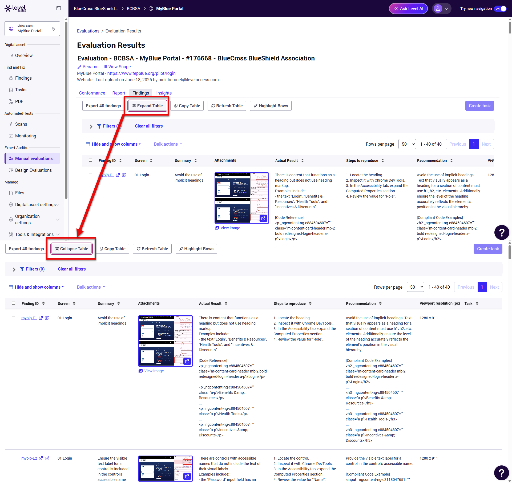
- Copy customized table content in rich HTML format for spreadsheet workflows.
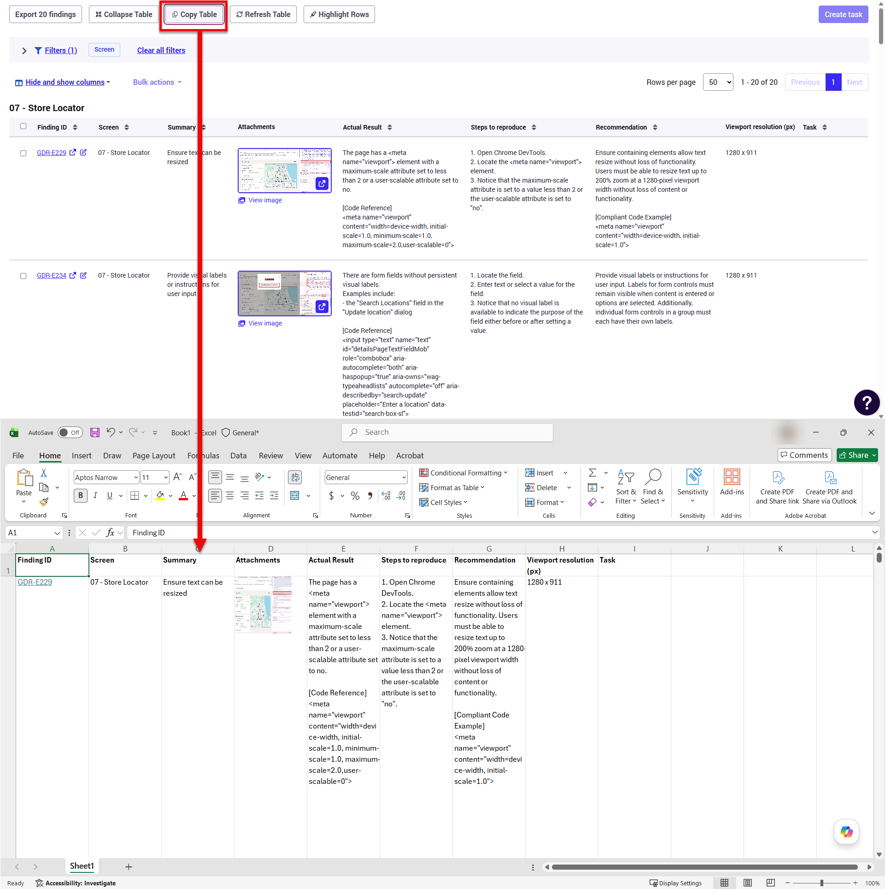
- Quick-access Refresh button to update table data without a full page refresh.
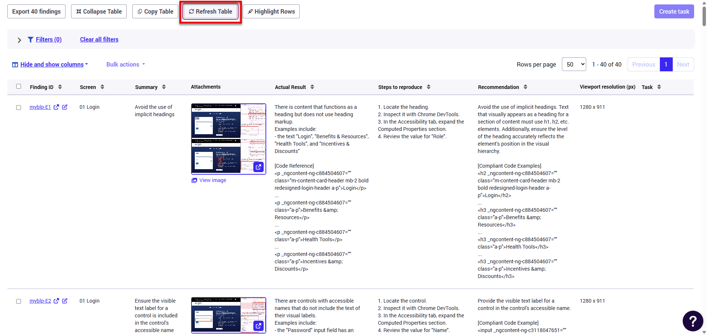
- Highlight the table rows for better visibility.

- View more than 6 columns of data for findings.
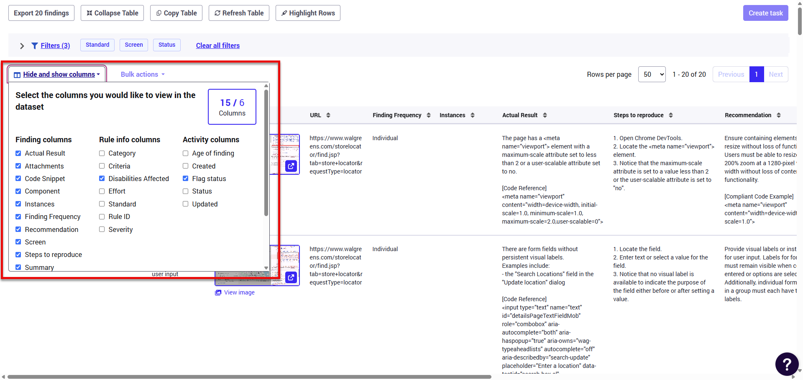
- Switch between screens from within the findings screen.
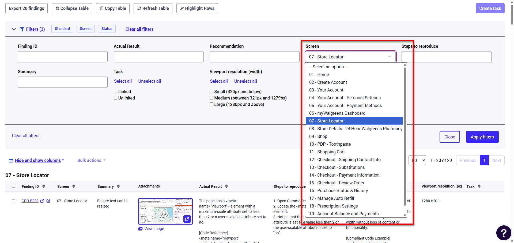
- Quick-access View Scope link to see all pages in an evaluation.
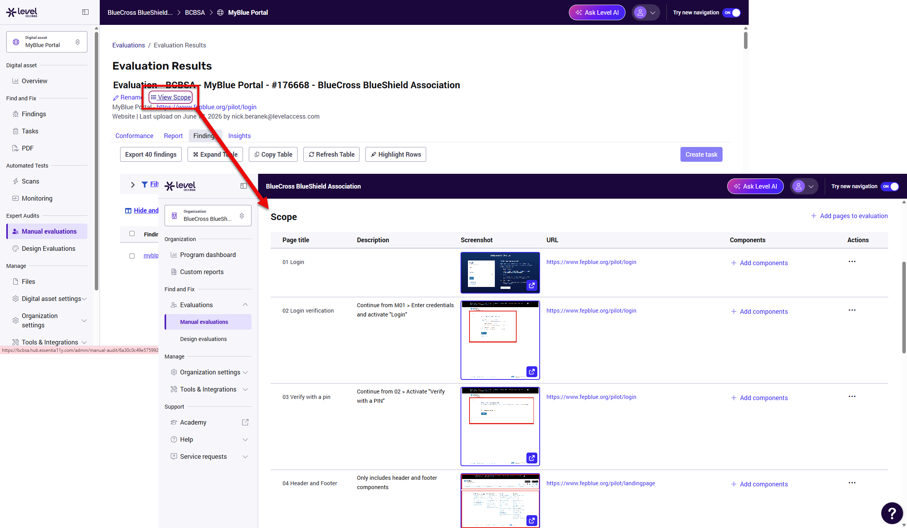
- Search manual evaluations by Issue or Task ID.
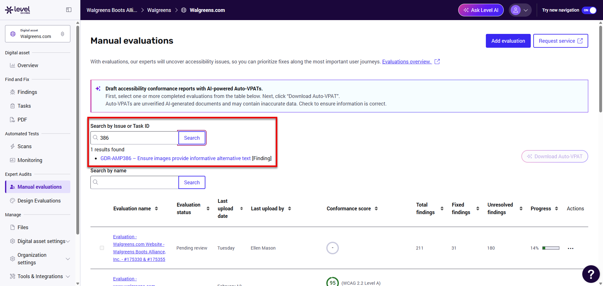

## Requirements

- A userscript manager such as Tampermonkey.
- Access to a supported Level Access platform domain:
  - `*.essentia11y.com/*`
  - `*.levelaccess.io/*`
  - `*.essentialaccessibility.com/*`
- jQuery is loaded via the userscript `@require` directive.

## Installation

1. Open Tampermonkey and go to Dashboard.
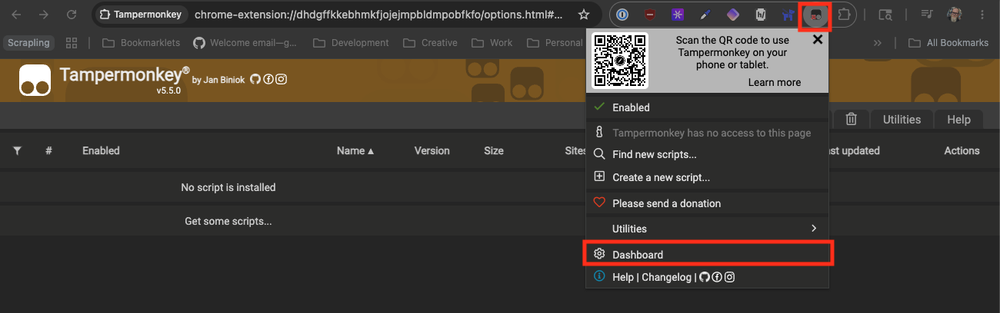
2. Open the Utilities tab.
3. Locate "Import from URL"

4. Paste in `https://raw.githubusercontent.com/ashleycallahan/LAPScript/refs/heads/main/LAPScript.js`.
5. Save and enable the script.
6. Open a supported Level Access Platform page.

## Disabling The Script
1. Open a supported Level Access Platform page.
2. Open Tampermonkey from your list of active extensions.
3. Toggle the active script ("Level Access Platform Script") to off.
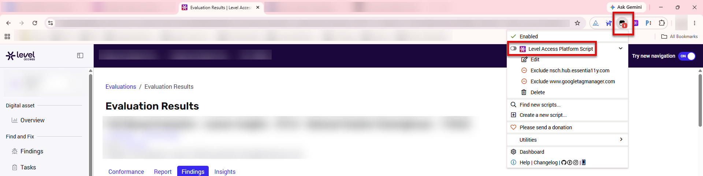

## Authors

- Original author: Ashley Callahan
